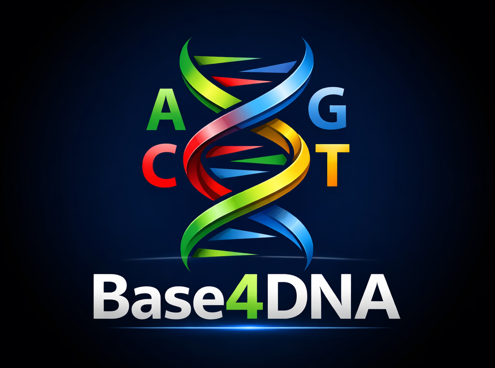

# 🧬 Base4DNA



> **All life is Base-4 encoded.**  
> This library just admits it.

**Base4DNA** is a tiny, playful, and fully deterministic encoding that represents binary data using only four characters:

```
A C G T
```

Each character encodes **2 bits**, inspired by DNA nucleotides.  
It’s a joke implementation — but a *correct*, *reversible*, and *well-tested* one.

## ✨ Features

- 🧪 **Base-4 encoding** using `A C G T`
- 🔁 **Lossless & reversible**
- 🧠 Simple, explicit bit mapping
- 🔊 Readable aloud (“A C G T”)
- 📄 Safe for text, logs, QR codes, and copy-paste
- 🦕 Zero dependencies
- 🧪 **Exhaustively tested** (all 256 byte values)

## 🧠 Encoding Rule

Each byte (8 bits) is split into 4 chunks of 2 bits:

| Bits | DNA |
|-----:|:---:|
| 00 | A |
| 01 | C |
| 10 | G |
| 11 | T |

### Example

```
0xCA = 11001010
      11 00 10 10
       T  A  G  G
```

```
0xFE = 11111110
      11 11 11 10
       T  T  T  G
```

➡️ Encoded as:

```
TAGGTTTG
```

## 🚀 Usage

### Encode / Decode bytes

```js
import { Base4DNA } from "https://code4fukui.github.io/Base4DNA/Base4DNA.js";

const bytes = new Uint8Array([0xCA, 0xFE]);
const dna = Base4DNA.encode(bytes);

console.log(dna);
// TAGGTTTG

const back = Base4DNA.decode(dna);
console.log(back);
// Uint8Array [202, 254]
```

### Encode / Decode UTF-8 strings

```js
const dna = Base4DNA.encodeString("Hello DNA 🧬", { group: 8 });
console.log(dna);

const text = Base4DNA.decodeString(dna);
console.log(text);
```

## ✂️ Grouping (Human-Friendly)

```js
Base4DNA.encode(bytes, { group: 4 });
// TAGG-TTTG
```

Decoding ignores spaces and common separators automatically.

## 🧪 Testing

Run all tests (including exhaustive byte tests):

```bash
deno test
```

## ⚠️ Notes

- Not compression
- Output is 4× longer than raw bytes
- Designed for fun, education, and visual encodings

## 🔗 References

- **How does string represent DNA sequence?**  - Engine Trouble, 2016
  https://enginetrouble.net/2016/12/how-does-string-represent-dna-sequence.html  

## 📜 License

CC0 / Public Domain.
